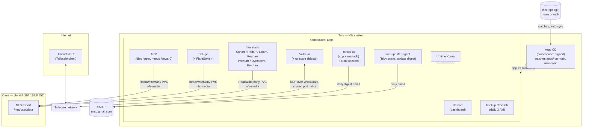
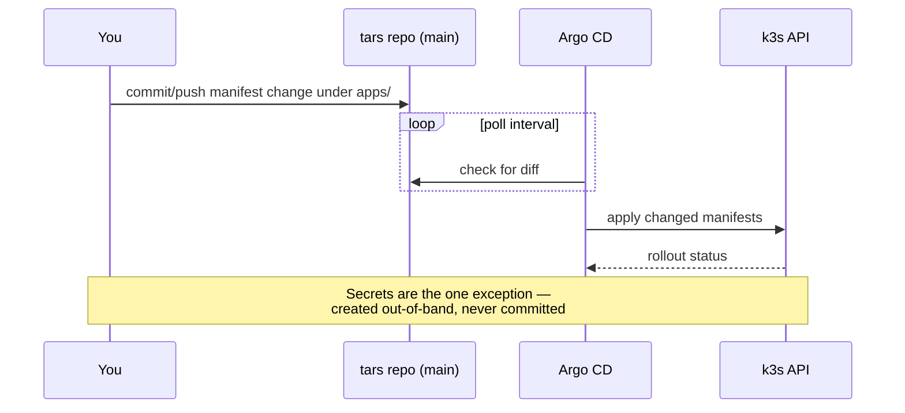

# Architecture

Two physical pieces: **Tars** (k3s cluster, compute) and **Case** (Unraid,
bulk storage). Everything deployed to Tars is defined in this repo's
[`apps/`](../apps/) and applied via GitOps, not by hand.

## System overview

## Deployment flow (GitOps)

## Storage model

- **Config/state** (app settings, databases like the HortusFox mariadb
  volume): `local-path` PVCs, backed by disk local to the k3s node. Covered
  by the daily `tars-appdata-backup` CronJob ([`apps/backup-cronjob.yaml`](../apps/backup-cronjob.yaml)).
- **Media** (`nfs-media-pvc`, `ReadWriteMany`): NFS export from Case at
  `192.168.8.152:/mnt/user/data`, mounted into every media-handling app
  (Sonarr/Radarr/Lidarr/Readarr/Deluge/ARM). Backup of this data is Case's
  responsibility, not this repo's.

## Notable design choices

- **Valheim over Tailscale, not port-forwarding**: the pod runs a Tailscale
  sidecar in the same network namespace as the game server, so the pod's
  tailnet IP *is* the game server address. No UDP ports opened to the
  internet, no NAT traversal. Full writeup: [`docs/valheim/README.md`](valheim/README.md).
- **Prowlarr + FlareSolverr**: Prowlarr centralizes indexer config for the
  *arr stack; FlareSolverr sits in front of indexers that use Cloudflare
  challenges.
- **tars-updater-agent**: a custom-built (not off-the-shelf) service —
  scans running container images with Trivy daily, and emails a weekly
  digest of pending OS/container updates. Findings persist in SQLite
  independent of email de-dup, queryable via `python -m app.report`. Source
  and deployment notes: [`tars-updater-agent/README.md`](../tars-updater-agent/README.md).
